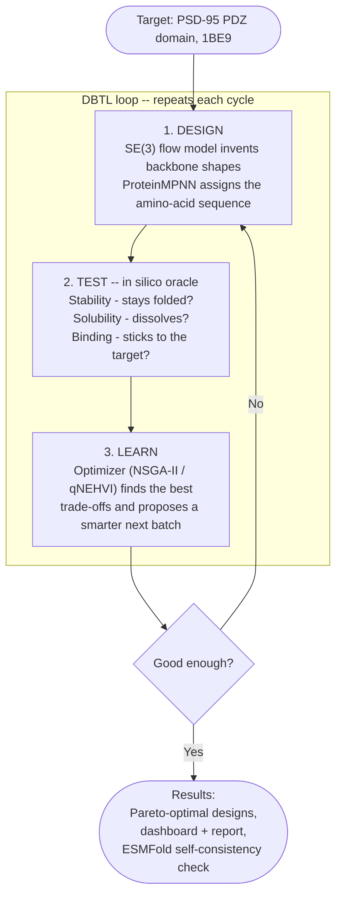

# PDZ De Novo — Closed-Loop Protein Binder Design

**Author:** Dr. Sanjay Anbu

A fully open-source **Design–Build–Test–Learn (DBTL)** platform for de novo design of
miniprotein binders against the **PSD-95 PDZ domain** (a central synaptic scaffolding
protein relevant to neural signaling and brain-computer interface tooling).

The system:

1. **Designs** candidate protein backbones with an SE(3)-equivariant **flow-matching**
   generative model (PyTorch).
2. **Assigns sequences** to backbones using an ESM-2 based inverse-folding / scoring step.
3. **Tests** candidates with a modular **simulated wet-lab oracle**:
   - Stability / foldability proxy (ESM-2 pseudo-log-likelihood; ESMFold pluggable).
   - Binding affinity proxy (AutoDock/`smina` docking to the PDZ domain).
   - Solubility / aggregation proxy (sequence-based model).
4. **Learns** by proposing the next library via **multi-objective optimization**
   (BoTorch qNEHVI or a genetic algorithm) over a Pareto front.
5. **Reports** progress in a **Streamlit** dashboard.

## How it works

You give it a target, and it repeatedly **generates → scores → improves** protein
candidates over several rounds — so instead of testing millions of designs in a
lab, you get a short list of the most promising ones automatically. Each round
gets better because the optimizer learns from the previous round's scores.



**In one sentence:** an automatic protein designer that invents candidate
binders, scores them, and iteratively improves them — a working miniature of a
closed-loop molecular-discovery platform. Swap the target and the same machine
designs a different molecule.

## Why this target?

PSD-95 PDZ domains organize the post-synaptic density and are fundamental to synaptic
signaling. A designed, modular binder is a plausible building block for targeting
BCI/neural-interface components to synapses — directly on-mission for neural-interface
research while remaining small enough to run on modest hardware.

## Hardware profile (dev machine)

- Intel i7-9850H (6C/12T), 16 GB RAM, 500 GB SSD
- NVIDIA Quadro RTX 3000, **6 GB VRAM**

The stack is tuned for 6 GB VRAM: small equivariant models, fp16, gradient
checkpointing, CPU fallbacks, and a lightweight default stability oracle.

## Quickstart

### 1. One-time setup

**Windows (PowerShell):**
```powershell
scripts\setup_env.ps1                 # creates .venv, installs CUDA torch + requirements
pip install "setuptools<81"           # MLflow 2.9 needs pkg_resources (removed in setuptools>=81)
python scripts\download_proteinmpnn.py
```

**Linux / macOS (bash):**
```bash
python3 -m venv .venv
source .venv/bin/activate
pip install --upgrade pip "setuptools<81" wheel
# GPU (Linux + NVIDIA):
pip install torch --index-url https://download.pytorch.org/whl/cu121
# CPU only / macOS (Apple Silicon uses MPS/CPU):
# pip install torch
pip install -r requirements.txt
pip install -e .
python scripts/download_proteinmpnn.py
```

### 2. Activate the environment (every new terminal)

| OS | Command |
|----|---------|
| Windows (PowerShell) | `.\.venv\Scripts\Activate.ps1` |
| Windows (cmd) | `.venv\Scripts\activate.bat` |
| Linux / macOS | `source .venv/bin/activate` |

### 3. Run the pipeline

The Python commands are identical across platforms (forward slashes work everywhere):

```bash
python scripts/verify_torch.py                                              # check GPU
python scripts/download_training_data.py                                    # training backbones
python scripts/train_generator.py --data-dir data/processed/train --length 64 --epochs 150
python scripts/validate_designs.py --n-backbones 4 --n-seqs 6               # scRMSD / pLDDT
python scripts/run_cycle.py --n-cycles 5 --library-size 32 --n-seed 16      # DBTL loop
python scripts/benchmark_optimizers.py --n-cycles 6                         # NSGA-II vs qNEHVI vs random
streamlit run app/streamlit_app.py                                          # dashboard
```

> On Windows you can use backslashes (`scripts\run_cycle.py`) too; see
> [`How-To-Run-Commands.txt`](How-To-Run-Commands.txt) for a Windows/cmd reference.

## Project layout

```
pdz-denovo/
├── configs/            # Hydra configuration
├── src/pdz_denovo/     # Library code
│   ├── data/           # PDB loading, target prep, featurization
│   ├── generative/     # SE(3)-equivariant flow-matching model
│   ├── sequence/       # ESM-2 sequence design / scoring
│   ├── oracle/         # stability + docking + solubility oracles
│   ├── optimize/       # multi-objective optimization (BoTorch / GA)
│   ├── loop/           # DBTL orchestration
│   ├── tracking/       # MLflow + JSON/CSV logging
│   └── utils/          # config, logging, seeding
├── app/                # Streamlit dashboard
├── scripts/            # entrypoints (download_data, run_cycle, setup_env)
├── tests/              # pytest unit tests
└── notebooks/          # exploration + final report
```

## License / data notes

- Code: MIT (see `LICENSE`).
- ESM-2 weights: released by Meta under permissive research terms — verify before any
  commercial use.
- PDB structures: freely available from RCSB PDB.

## Status

- **Phase 0 — Scaffold + data** ✅ Hydra configs, RCSB download, env setup, utils, tests.
- **Phase 1 — Simulated wet-lab oracle** ✅ ESM-2 stability + solubility + PDZ class-I
  binding, combined `OracleStack` with disk caching.
- **Phase 2 — SE(3) flow-matching generator** ✅ EGNN velocity field + conditional
  flow matching over Cα coordinates, with an equivariance test suite.
  - Smoke test (no GPU/data): `python scripts/train_generator.py --synthetic --epochs 5`
  - Real run: `python scripts/train_generator.py --data-dir data/processed --epochs 100`
- **Phase 3 — Sequence design (inverse folding)** ✅ ProteinMPNN Cα-only wrapper +
  PDZ class-I motif prior, emitting oracle-ready `Candidate`s. A torch-free
  fallback designer keeps the loop/tests runnable before ProteinMPNN is cloned.
  - Set up once: `python scripts/download_proteinmpnn.py`
- **Phase 4 — ESMFold self-consistency validation** ✅ refold designs (API-first
  ESMFold) and score **scRMSD** + **pLDDT** vs the designed backbone; end-to-end
  `scripts/validate_designs.py` chains generator → ProteinMPNN → ESMFold.
  - `python scripts/validate_designs.py --n-backbones 2 --n-seqs 4`
- **Phase 5 — DBTL loop + multi-objective optimization** ✅ closed loop (seed →
  oracle → optimizer → repeat) with **NSGA-II** and **BoTorch qNEHVI** optimizers,
  Pareto/hypervolume tracking, and MLflow+JSON logging.
  - `python scripts/run_cycle.py --n-cycles 5 --library-size 32 --n-seed 16`
  - Bayesian option: `python scripts/run_cycle.py --optimizer qnehvi`
- **Phase 6 — Dashboard + report** ✅ Streamlit dashboard (hypervolume trajectory,
  interactive Pareto front, optimizer benchmark, py3Dmol structure gallery),
  optimizer benchmark vs random search, technical report, and a training-data
  download pipeline.
  - Dashboard: `streamlit run app/streamlit_app.py`
  - Benchmark: `python scripts/benchmark_optimizers.py`
  - Training data: `python scripts/download_training_data.py`

**All six phases complete.** See [`docs/REPORT.md`](docs/REPORT.md) for the technical
report and [`docs/PLAN.md`](docs/PLAN.md) for the roadmap and hardware budget.

## Results

A representative closed-loop run improves the Pareto front every cycle, and both
optimizers beat a random-search baseline on hypervolume (higher = better),
NSGA-II reaching the best front:

| optimizer | HV cycle 0 → 5 | final |
|-----------|----------------|------:|
| random (baseline) | 5.70 → 5.91 | 5.91 |
| **NSGA-II** | 5.70 → 6.18 | **6.18** |
| qNEHVI (BoTorch) | 5.70 → 6.01 | 6.01 |

Reproduce with `python scripts/benchmark_optimizers.py`. At this small scale
(cheap proxy oracle, ~130 evaluations) a genetic algorithm competes with
Bayesian optimization; BO's advantage grows with expensive evaluations and tight
query budgets. See [`docs/REPORT.md`](docs/REPORT.md) for discussion.
